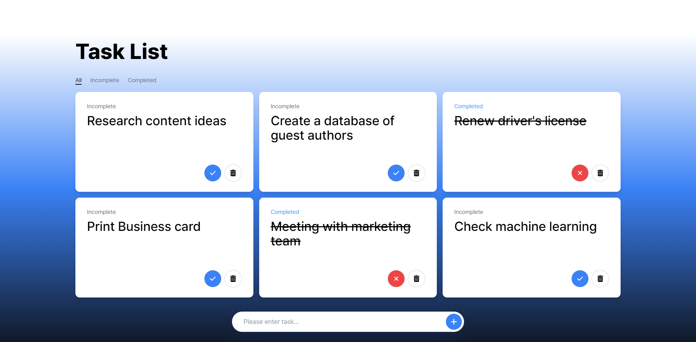

# React Study

> Date Studied : 2024-08-30 (Fri) ~ ???

## 📅 Study Journal

### 2024-08-30 (Fri)

- npm install, react install, run react.
- learned to JSX, component, useState, useRef, useEffect.

### 2024-08-31 (Sat)

- learned to react-icons, useMemo, useState Previous Data, useCallback, useContent, useId, custom hooks
- Tailwind CSS install and [study](https://tailwindcss.com/docs/guides/create-react-app).
- Creating a todo List(Task List) with React.

### 2024-09-01 (Sun)

- Deployed react Todo List Project with vercel.
- Upgrade Crud in Project 1 (Todo List) using a custom hook.

### 2024-09-02 (Mon)

- Project 2 Planning
- Studying Ai Service related to Project 2

## 📕 React Project

## 1. Todo List (2024-08-31)

### Demo
https://react-study-project-1.vercel.app/

### Features
- task add, complete toggle, delete, tab menu
- Retain data across refreshes using localStorage

## 2. Ai Service (2024-09-02 ~ ???)

### Demo

In development...

### Features

- One-to-one conversation with chat bot using openai API
- Maintain conversation history using localStorage
- Stream AI-generated content

### etc (thinking)
- dark mode
- recommend question
- voice question
